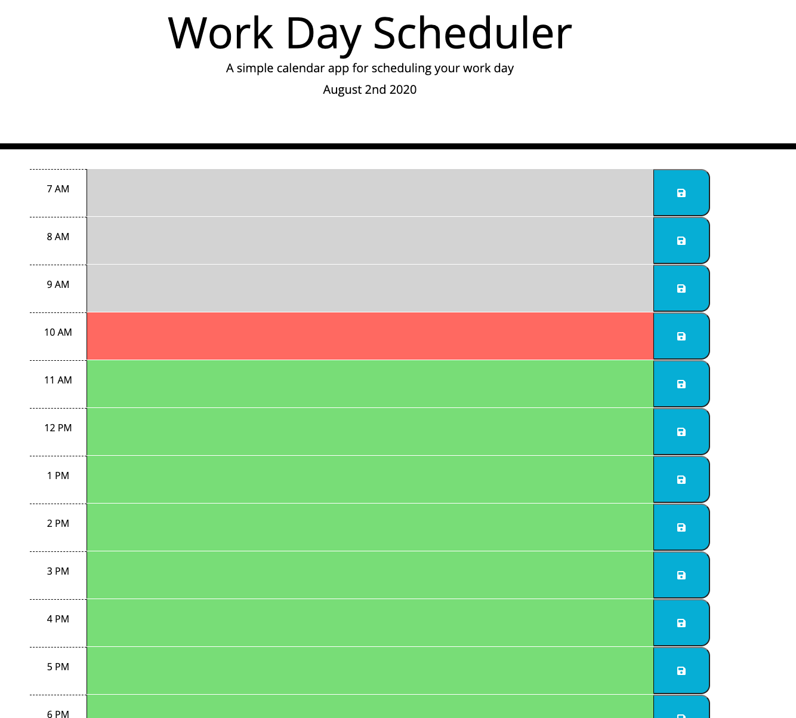

# DayScheduler

### https://n-lambert.github.io/scheduler/ ###

## Table Of Contents ##

- [Section 1: Introduction](#introduction)
- [Section 2: Usage](#usage)
- [Section 3: Credits](#credits)
- [Section 4: License](#license)

## Introduction ##

This is a simple calendar application that allows the user to save events for each hour of the day. This app will run in the browser and feature dynamically updated HTML and CSS powered by jQuery.

## Usage ##

Anyone is free to find the source code here on GitHub. You can access the files through cloning the repo. 

To run the schedule calendar visit the URL beneath the website screenshot. Each timeblock is color coded to indicate whether it is in the past (grey), present(red), or future(green). Clicking a timeblock allows you to enter an event for a given hour. Clicking the save icon will save the event detail to local storage where it will persist on each reload of the page. 

## Credits ##

## License ##

GNU General Public License